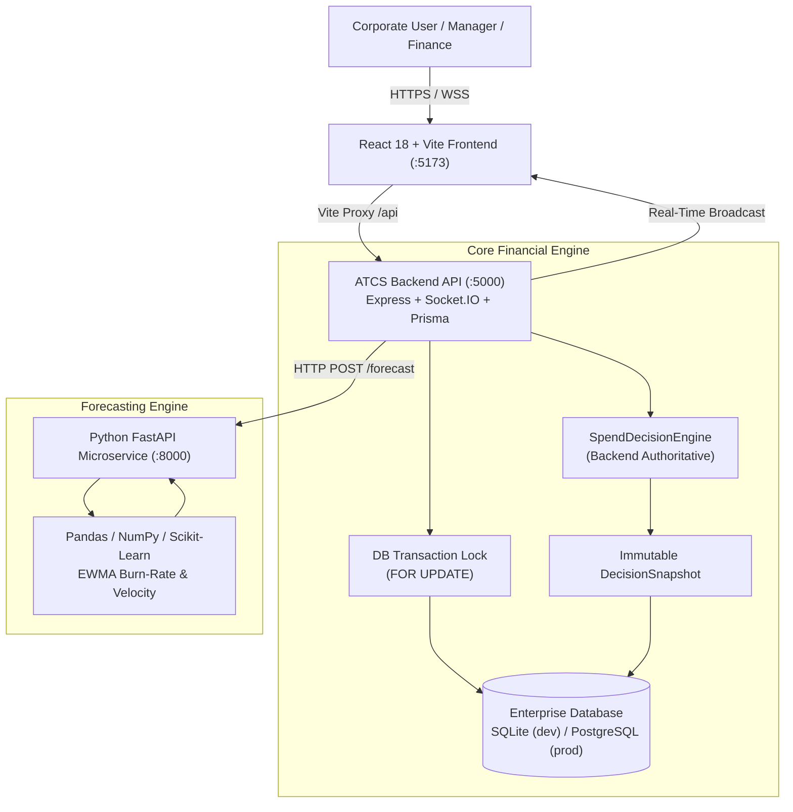
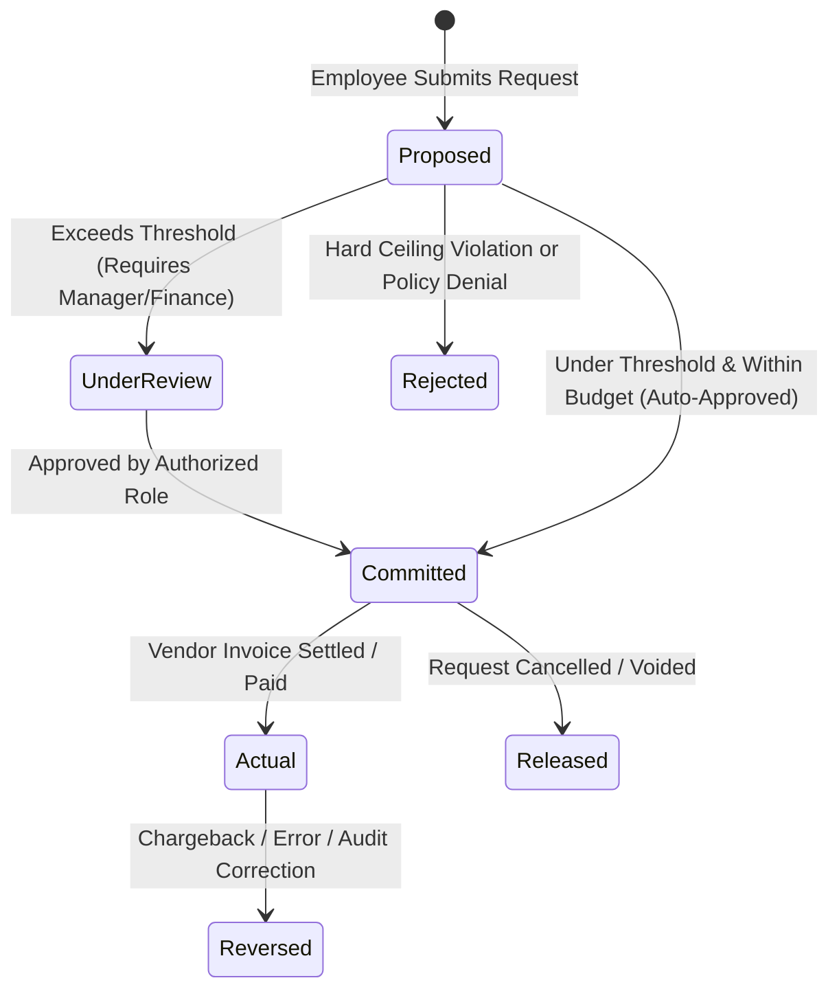

# ATCS — Audit Trailing & Control System

> **A real-time, rule-driven corporate spend-control and financial audit platform.**  
> ATCS enforces financial governance **before money is committed**, maintaining absolute separation between Proposed, Committed, and Actual spend with 100% explainable verdicts, database-level concurrency protection, and statistical velocity forecasting.

---

## 📑 Table of Contents

- [Executive Summary](#-executive-summary)
- [Core Financial Principles](#-core-financial-principles)
- [System Architecture](#-system-architecture)
- [The Three Financial States](#-the-three-financial-states)
- [Core Demonstration Scenarios](#-core-demonstration-scenarios)
- [Technology Stack](#-technology-stack)
- [Project Directory Layout](#-project-directory-layout)
- [Quick Start Guide](#-quick-start-guide)
- [Pre-Seeded Enterprise Accounts](#-pre-seeded-enterprise-accounts)
- [Interactive Features & Capabilities](#-interactive-features--capabilities)
- [API Reference](#-api-reference)
- [Test Suite & Formal Verification](#-test-suite--formal-verification)
- [License](#-license)

---

## 🏛 Executive Summary

Traditional corporate expense systems suffer from a structural flaw: **post-facto tracking**. Employees spend company capital first and submit receipts weeks later, leaving finance teams to deal with budget overruns, policy breaches, and delayed reconciliation.

**ATCS flips this paradigm through Preemptive Spend Governance:**
1. **Pre-Commitment Enforcement**: Every expenditure is evaluated against department budgets, category allocations, and approval thresholds *before* capital is committed.
2. **Deterministic Explanations**: No vague rejections. Every decision outputs mathematical proofs: `Actual + Committed + Proposed = Projected vs Governing Budget`.
3. **Point-in-Time Audit Integrity**: When a decision is made, an immutable `DecisionSnapshot` freezes the exact numbers and rules active at that microsecond.
4. **Concurrency Safety**: Double-spend prevention via strict database transaction locking (`FOR UPDATE` row locks).
5. **Transparent Forecasting**: Real statistical burn-rate analysis (Exponential Weighted Moving Average) without fabricated synthetic data.

---

## 💎 Core Financial Principles

| Principle | ATCS Implementation |
| :--- | :--- |
| **Backend-Authoritative Calculation** | The frontend *never* computes financial availability or verdicts. All calculations are executed strictly by [`SpendDecisionEngine`](backend/src/services/SpendDecisionEngine.ts). |
| **Decimal Precision** | Eliminates IEEE 754 floating-point drift. All currency arithmetic uses 28-digit precision (`decimal.js` with `ROUND_HALF_UP`). |
| **Three Financial States** | Clean separation of **Proposed** (`SpendingRequest`), **Committed** (`Commitment`), and **Actual** (`Transaction`). |
| **Race-Condition Protection** | Concurrent requests lock the department budget row during evaluation to prevent simultaneous over-subscription. |
| **Immutable Decision Snapshots** | Stores historical budget snapshots so future budget expansions never distort past audit trails. |
| **Graceful Microservice Fallback** | If the Python forecasting microservice is unreachable, the core Node.js transactional engine continues running with linear velocity fallbacks. |

---

## 🏗 System Architecture

ATCS is designed as a **Modular Monolith** for transactional financial integrity, coupled with an asynchronous **Python Forecasting Microservice** for statistical velocity modeling and real-time **Socket.IO** for live multi-user notifications.



---

## 🔄 The Three Financial States

ATCS models the complete lifecycle of corporate spend across three isolated states:



1. **Proposed Spend (`SpendingRequest`)**: A pending request being drafted or evaluated. Does not consume budget until approved.
2. **Committed Spend (`Commitment`)**: Approved funds earmarked for a specific vendor or PO. Consumes available budget, blocking other requests from taking those funds.
3. **Actual Spend (`Transaction`)**: Settled, realized outflows from credit card feeds, bank transfers, or ERP/CSV imports. Automatically settles against and decrements the corresponding commitment.

---

## 🎯 Core Demonstration Scenarios

ATCS includes an **Interactive Sandbox (`/sandbox`)** that demonstrates the three fundamental governance paths in 1 click:

### Scenario A: Clean Approval (Under Budget & Under Threshold)
- **Budget**: ₹100,000 | **Actual**: ₹20,000 | **Committed**: ₹10,000 | **Request**: ₹5,000
- **Projected Total**: ₹35,000 (35.0% Utilization)
- **Verdict**: `APPROVE` (Funds instantly earmarked into an active Commitment).

### Scenario B: Approval Required (Within Budget, Crosses Threshold)
- **Budget**: ₹100,000 | **Actual**: ₹50,000 | **Committed**: ₹20,000 | **Request**: ₹20,000
- **Projected Total**: ₹90,000 (90.0% Utilization)
- **Verdict**: `APPROVAL_REQUIRED` (Triggers `MANAGER` approval workflow; sends warning alert for crossing 80% ceiling).

### Scenario C: Budget Overrun Violation (Over Budget Ceiling)
- **Budget**: ₹100,000 | **Actual**: ₹60,000 | **Committed**: ₹30,000 | **Request**: ₹20,000
- **Projected Total**: ₹110,000 (110.0% Utilization)
- **Verdict**: `VIOLATION`
- **Explainable Audit Formula**:
  ```text
  "Budget exceeded because Actual (₹60,000.00) + Committed (₹30,000.00) + Proposed (₹20,000.00) 
  = Projected Total (₹110,000.00), which exceeds Governing Budget (₹100,000.00) by ₹10,000.00."
  ```

---

## 💻 Technology Stack

### Frontend Client (`frontend/`)
- **Core Framework**: React 18, TypeScript, Vite
- **Styling**: Tailwind CSS, PostCSS (Enterprise Dark/Light System)
- **Icons**: Lucide React
- **Data Visualization**: Recharts (Budget dials, burn-rate trends, category distributions)
- **Real-Time Transport**: Socket.IO Client

### Backend API Server (`backend/`)
- **Runtime**: Node.js v20+, TypeScript
- **Framework**: Express.js
- **ORM & Data Layer**: Prisma ORM with SQLite (`dev.db`) and PostgreSQL support (`schema.postgresql.prisma`)
- **Financial Arithmetic**: `decimal.js` (Fixed 28-digit financial math)
- **Security & Validation**: JWT (`jsonwebtoken`), `bcryptjs`, `zod` request contracts
- **Data Ingestion**: `multer`, `csv-parser`
- **Real-Time Gateway**: Socket.IO Server

### Forecasting Engine (`forecast-service/`)
- **Runtime**: Python 3.10+
- **API Framework**: FastAPI, Uvicorn
- **Data Science**: Pandas, NumPy, Scikit-learn
- **Methodology**: Exponential Weighted Moving Average (EWMA) + Daily Velocity Variance

---

## 📂 Project Directory Layout

```text
ATCS/
├── package.json                 # Monorepo management scripts
├── .gitignore                   # Workspace exclusions
├── README.md                    # Project documentation
│
├── backend/                     # Node.js Financial API & Decision Engine
│   ├── prisma/
│   │   ├── schema.prisma        # Active SQLite schema (zero-setup instant run)
│   │   ├── schema.postgresql.prisma # Production PostgreSQL schema
│   │   ├── seed.ts              # Enterprise database seeder
│   │   └── dev.db               # Local SQLite database
│   ├── src/
│   │   ├── index.ts             # Express & Socket.IO server bootstrap
│   │   ├── prisma.ts            # Prisma client & Decimal converters
│   │   ├── socket.ts            # WebSocket event emitters
│   │   ├── middleware/          # Auth, role authorization, Zod validation
│   │   ├── models/types.ts      # Strictly typed domain enums
│   │   ├── routes/              # Modular REST routes (Auth, Budgets, Sandbox...)
│   │   └── services/            # 13 Domain Services:
│   │       ├── SpendDecisionEngine.ts  # Authoritative mathematical evaluator
│   │       ├── BudgetService.ts        # Utilization & spend aggregation
│   │       ├── SpendingService.ts      # Preview & transactional commit
│   │       ├── ApprovalService.ts      # Multi-tier approval workflows
│   │       ├── CommitmentService.ts    # Outstanding commitment lifecycle
│   │       ├── TransactionService.ts   # Realized actuals & reversals
│   │       ├── CsvIngestionService.ts  # Pre-flight CSV validator & atomic importer
│   │       ├── ForecastService.ts      # Bridge to Python forecasting service
│   │       ├── DashboardService.ts     # Aggregated executive KPIs
│   │       ├── AuditService.ts         # Immutable audit logging & snapshots
│   │       ├── AlertService.ts         # Utilization threshold warnings
│   │       ├── ExceptionService.ts     # Policy exception handling
│   │       └── AuthService.ts          # Identity & credential verification
│   └── tests/
│       └── SpendDecisionEngine.test.ts # Standalone 100% test suite
│
├── forecast-service/            # Python Statistical Forecasting Engine
│   ├── app/
│   │   ├── main.py              # FastAPI endpoints (/forecast, /health)
│   │   ├── forecaster.py        # EWMA burn-rate and velocity algorithms
│   │   └── models.py            # Pydantic request/response schemas
│   ├── requirements.txt         # Python dependencies
│   └── run.py                   # Service launcher (Port 8000)
│
└── frontend/                    # React 18 Enterprise UI
    ├── src/
    │   ├── App.tsx              # Router & authentication guards
    │   ├── index.css            # Tailwind design system & tokens
    │   ├── components/          # Navigation, Header, Badges, Modals
    │   ├── context/             # AuthContext & SocketContext
    │   ├── services/            # Typed API client
    │   └── pages/               # 14 Full enterprise interfaces:
    │       ├── LoginPage.tsx
    │       ├── DashboardPage.tsx
    │       ├── SpendPreviewPage.tsx     # Debounced "Spend Before You Spend"
    │       ├── SpendRequestsPage.tsx
    │       ├── ApprovalsPage.tsx
    │       ├── BudgetsPage.tsx
    │       ├── TransactionsPage.tsx     # With CSV drag-and-drop previewer
    │       ├── CommitmentsPage.tsx
    │       ├── ForecastsPage.tsx
    │       ├── AlertsPage.tsx
    │       ├── AuditPage.tsx
    │       ├── ExceptionsPage.tsx
    │       ├── RulesPage.tsx
    │       └── SandboxPage.tsx          # 1-click Scenarios A, B, C
    └── vite.config.ts           # Reverse-proxy to backend (:5000)
```

---

## 🚀 Quick Start Guide

### Prerequisites
- **Node.js**: v18.0.0 or higher
- **Python**: v3.9 or higher (with pip)
- **Git**

### 1. Installation

Clone the repository and install all dependencies:

```bash
# Clone the repository
git clone <repo-url>
cd ATCS

# Install backend dependencies
cd backend
npm install

# Install frontend dependencies
cd ../frontend
npm install

# Install Python forecast dependencies
cd ../forecast-service
pip install -r requirements.txt
cd ..
```

### 2. Database Initialization & Seeding

ATCS comes pre-configured with a zero-setup local SQLite database for instant development:

```bash
cd backend

# Push the schema to the database
npx prisma db push

# Seed enterprise roles, users, departments, budgets, rules, and baseline transactions
npx ts-node --transpile-only prisma/seed.ts
cd ..
```

### 3. Launching the Services

Open three terminal windows (or run as background processes):

#### Terminal 1: Python Forecasting Service (Port 8000)
```bash
cd forecast-service
python run.py
```

#### Terminal 2: Node.js Backend API (Port 5000)
```bash
cd backend
npm run dev
# or: node dist/index.js
```

#### Terminal 3: React Frontend (Port 5173)
```bash
cd frontend
npm run dev
```

Open your browser at **[http://localhost:5173](http://localhost:5173)**.

---

## 🔑 Pre-Seeded Enterprise Accounts

All demo users share the password: `password123`

| Email | Role | Department | Description & Permissions |
| :--- | :--- | :--- | :--- |
| `admin@atcs.corp` | **ADMIN** | Global | Full governance, rule creation, audit inspection, system configuration |
| `finance@atcs.corp` | **FINANCE** | Executive | Executive approvals (>₹100k), budget allocations, CSV import, reversals |
| `manager.eng@atcs.corp` | **MANAGER** | Engineering | Department manager approval (>₹15k), Engineering budget tracking |
| `employee.eng@atcs.corp` | **EMPLOYEE** | Engineering | Staff engineer, spend creation, live simulation, commitment monitoring |
| `manager.mkt@atcs.corp` | **MANAGER** | Marketing | Marketing manager approval, campaign spend governance |
| `employee.mkt@atcs.corp` | **EMPLOYEE** | Marketing | Growth marketing lead, campaign spend submission |

---

## ✨ Interactive Features & Capabilities

### 1. Real-Time "Spend Before You Spend" Simulator (`/spend/preview`)
- As you type the requested amount and select a category, a 300ms debounced preview evaluates against governing rules in the background.
- Instantly visualizes:
  - Current vs Projected Utilization progress bar.
  - Balance before and remaining balance after spend.
  - Explainable verdict badge (`APPROVE`, `APPROVAL_REQUIRED`, `VIOLATION`).
  - Specific rule warnings (e.g., crossing 80% ceiling) or approval role requirements.

### 2. 1-Click Interactive Sandbox (`/sandbox`)
- Allows stakeholders and auditors to verify decision determinism across **Scenarios A, B, and C**.
- Displays the exact payload, mathematical proof, policy warnings, and audit snapshot generated.

### 3. Pre-Flight CSV Ingestion (`/transactions`)
- Financial admins can upload bulk transaction CSVs.
- **Two-phase commit**:
  1. **Preview Phase**: Validates references, checks for duplicate external IDs, validates department codes, and flags overruns row-by-row.
  2. **Commit Phase**: Executes the import inside a single database transaction. If any invalid row exists, the user can review before committing.

### 4. Real-Time WebSocket Alerts & Updates
- Multi-client synchronization via Socket.IO:
  - Spend submissions instantly alert department managers.
  - Utilization warnings (>80%, >95%) trigger real-time toast alerts for Finance admins.
  - Transaction settlements update live dashboard charts without page refresh.

### 5. Client Quotation & Proposed Budget Performance Hub (`/client-budget`)
- **Preemptive Quotation Governance**: Track client or contract-level proposed budgets (e.g. ₹25,00,000 baseline) and observe financial performance across the enterprise.
- **Key Metrics Tracked**:
  - **Gross Proposed Budget**: Total quoted contract value.
  - **Incurred Expenses**: Exact sum of actual settled transactions + active commitments.
  - **Leftover Budget / Net Finances**: Remaining liquid capital and cash reserves ($Gross - Incurred$).
  - **Profit Margin %**: Mathematical margin ($Net / Gross \times 100$) tracked against contract target margin.
  - **Estimation of Completion**: Project burn velocity, Estimated Cost at Completion (EAC), Variance at Completion (VAC), and feasibility status (`HEALTHY_PROFIT`, `MARGIN_PRESSURE`, `BUDGET_OVERRUN_RISK`).
- **Department-by-Department Individual Expense Matrix**:
  - Full tracking for **every single department** (Engineering, Marketing, Operations, Sales, Human Resources).
  - Department individual expenses: Actual Spend vs Committed Spend, Leftover Budget, Profit Margin %, Cost Share %, and department-level EAC.
- **Interactive Quotation Simulator**:
  - Test any hypothetical client proposed budget (e.g. ₹15L, ₹25L, ₹50L) with instant recalculation of profit margins, leftover capital, and department distributions.

---

## 📡 API Reference

### Authentication
- `POST /api/auth/login` — Authenticate user and issue JWT token
- `GET /api/auth/me` — Retrieve active authenticated user profile

### Spend Decision & Simulation
- `POST /api/spending/preview` — Run pure calculator simulation without database mutations
- `POST /api/spending` — Submit spend request with concurrency row-locking
- `GET /api/spending` — List spending requests with status filters

### Budgets & Allocations
- `GET /api/budgets` — List active department budgets
- `GET /api/budgets/:id/utilization` — Authoritative real-time utilization breakdown
- `POST /api/budgets` — Create new fiscal period budget with category allocations

### Approvals
- `GET /api/approvals/pending` — Pending approval queue for the authenticated role
- `POST /api/approvals/:id/action` — Approve or reject pending spend request

### Transactions & CSV Ingestion
- `GET /api/transactions` — Query settled transactions
- `POST /api/transactions` — Record manual transaction settlement
- `POST /api/transactions/import-preview` — Pre-flight CSV validator
- `POST /api/transactions/import-commit` — Atomic database batch ingestion
- `POST /api/transactions/:id/reverse` — Reverse transaction with audit justification

### Forecasting & Analytics
- `GET /api/forecast?departmentId=...` — Query EWMA burn-rate and velocity projections
- `POST /api/forecast/recalculate` — Trigger on-demand model re-run
### Client Quotations & Proposed Budget Tracking
- `GET /api/client-budget` — Query active client quotation analytics, gross/net finances, and departmental expenses
- `GET /api/client-budget/list` — List all stored client quotations
- `POST /api/client-budget/simulate` — Real-time simulation of any proposed budget or quotation from client
- `POST /api/client-budget` — Create and store new client quotation with department allocations

### Interactive Sandbox
- `POST /api/sandbox/scenario/:scenarioType` — Execute Scenario A, B, or C with simulation flags

---

## 🧪 Test Suite & Formal Verification

The core financial logic is protected by a dedicated, zero-dependency unit test suite:

```bash
cd backend
npx ts-node --transpile-only tests/SpendDecisionEngine.test.ts
```

### Verified Test Cases:
```text
====================================================
🧪 RUNNING ATCS FINANCIAL DECISION ENGINE TEST SUITE
====================================================
--- TEST 1: SCENARIO A (BEST CASE) ---
✅ PASSED: Scenario A verdict must be APPROVE
✅ PASSED: Scenario A projected spend must equal ₹35,000
✅ PASSED: Scenario A available before must equal ₹70,000
✅ PASSED: Scenario A remaining after must equal ₹65,000
✅ PASSED: Scenario A utilization after must equal 35.0%
✅ PASSED: Scenario A must have 0 violations

--- TEST 2: SCENARIO B (AVERAGE CASE) ---
✅ PASSED: Scenario B verdict must be APPROVAL_REQUIRED
✅ PASSED: Scenario B projected spend must equal ₹90,000
✅ PASSED: Scenario B approvalRequired flag must be true
✅ PASSED: Scenario B must require MANAGER role
✅ PASSED: Scenario B utilization after must equal 90.0%

--- TEST 3: SCENARIO C (WORST CASE) ---
✅ PASSED: Scenario C verdict must be VIOLATION
✅ PASSED: Scenario C projected spend must equal ₹1,10,000
✅ PASSED: Scenario C remaining after must equal -₹10,000
✅ PASSED: Scenario C utilization after must equal 110.0%
✅ PASSED: Scenario C must contain descriptive violation message
✅ PASSED: Scenario C must contain exact explainable formula in violation message

--- TEST 4: PRIORITY RESOLUTION HIERARCHY ---
✅ PASSED: Hard VIOLATION must always override WARNING status

--- TEST 5: DECIMAL PRECISION ACCURACY ---
✅ PASSED: Decimal precision must strictly preserve 99,999.99 without rounding artifacts
✅ PASSED: Decimal precision remaining must equal 0.01
✅ PASSED: 99,999.99 against 100,000 must be APPROVE

--- TEST 6: CURRENCY DENOMINATION MISMATCH ---
✅ PASSED: Currency mismatch USD vs INR must produce VIOLATION

--- TEST 7: ZERO OR NEGATIVE SPEND VIOLATION ---
✅ PASSED: Negative spend must produce VIOLATION

====================================================
🎉 ALL FINANCIAL TESTS PASSED WITH 100% SUCCESS!
====================================================
```

---

## 📄 License

This project is licensed under the MIT License — see the [LICENSE](LICENSE) file for details.
